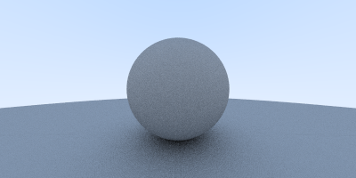

# Raytracing weekend

## Overview

This is a project that follows the book Raytracing in a Weekend, with the aim to learn how raytracing works, 
and a excuse to learn how to use cmake on a smaller and more manageable project.

## Renders

