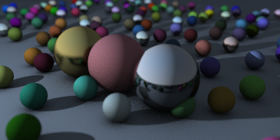
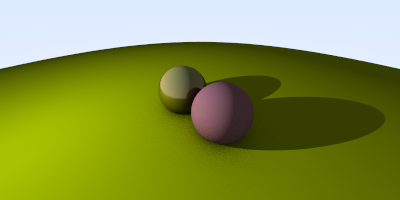
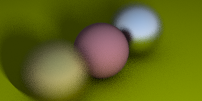

# Raytracing weekend

## Cover image

## Overview

This is a project that follows the book Raytracing in a Weekend, with the aim to learn how raytracing works, 
and a excuse to learn how to use cmake on a smaller and more manageable project.

## Scope

This is not a complete project, I hope to return to it one day, from the book it's just missing 
the dielectric material, I might as well just return to the idea and rebuild it better from the start
eiter just software or using OpenGL or something.

## Renders

